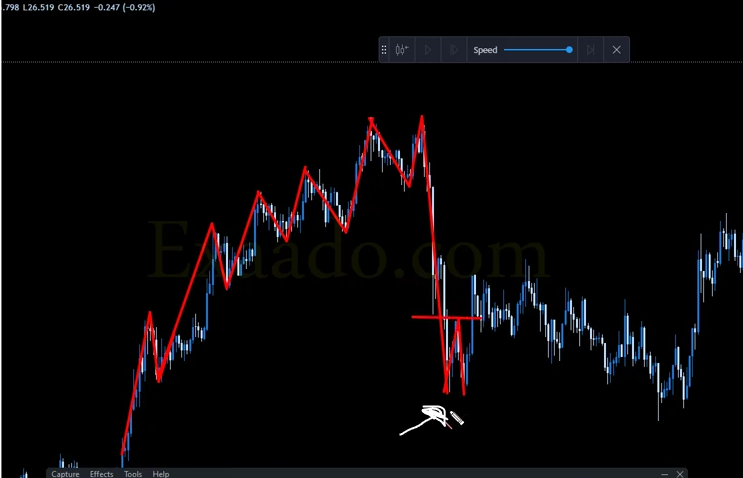
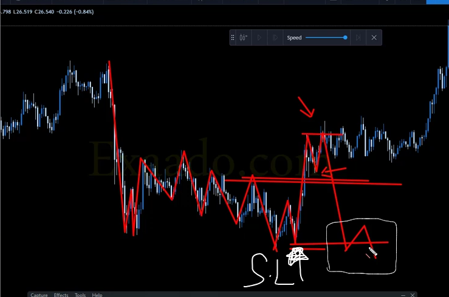
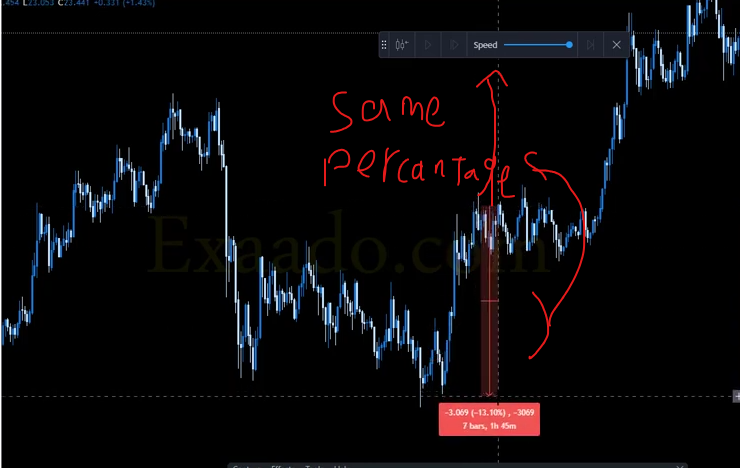

###  استراتيجيه الدخول الثانى 
- success rate : above 90%
- not use in side way , angle is minium 45 (up or down)
- don't close trades that opened with that stategy unless it has the reverse of it 
- if two swing low has the same level we take the first (left one)
    
- stop lose is the last swing low (لازم الاستراتيجيه تحصل عشان اطلع متحطوش سيل ليميت )
    
- Target : 1 to 1 (between entry and SL) or closest resistance or fibonacii(not studied yet)
    

