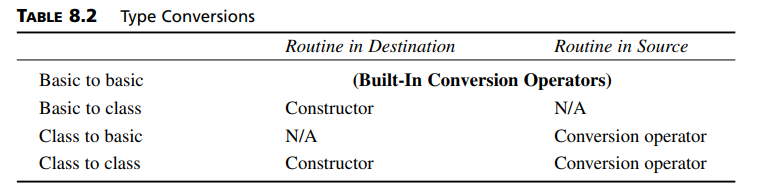

# chapter 8

## Operator overloading : 
-  number of args = number of operands -1 (general rule but except friend functions)
- **Overloading Unary Operators**
    - Overloading Unary Operators
        - prefix : Object operator ++ ()
        - postfix : Object operator ++ (int) -> indicator to the compiler and must be "int"
- **Overloading Binary Operators**
    - Arithmetic Operators : + * - /
    - Comparison Operators : > < >= 
    - Arithmetic Assignment Operators : += -=

- **there is three ways inserting and reading the array elements :**
    - Separate put() and get() functions 
        - void put(int n, int elvalue)
        - int get(int n) const
    - Single access() Function Returning by Reference 
        - int& access(int n)
    - Overloaded [] Operator Returning by Reference 
        - int& operator [](int n) (if you want to set you must usereference )

## Data Conversion
- **Conversions Between Objects and Basic Types :**
    ```cpp
    class Distance //English Distance class
    {
    private:
        const float MTF; //meters to feet
        int feet;
        float inches;
    public: //constructor (no args)
        Distance() : feet(0), inches(0.0), MTF(3.280833F)
        { } //constructor (one arg)
        Distance(float meters) : MTF(3.280833F)
        { //convert meters to Distance
        } //constructor (two args)

        Distance(int ft, float in) : feet(ft),
        inches(in), MTF(3.280833F)
        { }
        void showdist() const //display distance
        { cout << feet << "\'-" << inches << '\"'; }
        operator float() const //conversion operator
        { //converts Distance to meters
        return 0.0; //convert to meters
        }
    };
    ```
    ```cpp
    Distance dist1 = 2.35F; //this converts from float to user-defined class
    ```
    ```cpp
    Distance dist2(5, 10.25);
    float mtrs;
    mtrs = static_cast<float>(dist2); //uses conversion operator
    mtrs = dist2; //also uses conversion op
    ```
    ```cpp
    dist2 = mtrs; /*error, = won’t convert 
    because object is already instatiated and can't call constructor to convert */
    ```
    - if we use ```cout << user-defined object``` and there is an operator to convert to **(char\* or string)** it will be printed ;
    - Note that you can’t use an explicit assignment statement to convert a String to a C-string:
    ```cpp
    char xstr[] = s2; // s2 is a user-defind has char* operator because xstr is an array 
    //but we can write :
    char *xstr = s2;
    ```
- **Conversions Between Objects of Different Classes :**
    - the same thing as convert to basic types but if we convert
        ```cpp
        objecta = objectb;
        ``` 
        the conversion depend on class location(the destination class, since objecta receives the value) or class B(the source class)? We’ll look at both cases 
        the conversion is :
        ```cpp
        time12 t12 = t24; //convert time24 to time12
        ```
        - **Routine in Source Object :**
            we will use operator conversion :
            ```cpp
            operator time12() const; //conversion operator
            ```
        - **Routine in Destination Object :**
            we will use constructor :
            ```cpp
            time12(time24); //1-arg constructor
            // since data in time24 is private so we use getters
            ```
- **summary**
    
- **Conversions: When to Use What:**
    - if you use a library that has some classes so If you use an object of such a class as the source in a conversion, you’ll have access only to the destination class, and you’ll need to use a one-argument constructor. 
    If6 the library class object is the destination, you must use a conversion operator in the source.
- **Not All Operators Can Be Overloaded**
    The following operators cannot be overloaded: the member access or dot operator (.), the
    - scope resolution operator (:\:)
    - conditional operator (?\:)
    - the pointer-to-member operator (->) 
    - you can’t create new operators (like *&) and try to overload them; only existing operators can be overloaded.
## UML Class Diagrams 
- very basic i will summary it from mostafa saad
## Keywords explicit and mutable
- they both modify class members. The explicit keyword relates to data conversion, but mutable has a more subtle purpose.
    - **Preventing Conversions with explicit:**
        - It’s easy to prevent a conversion performed by a conversion operator: just don’t define the operator
        - things aren’t so easy with constructors , You may want to construct objects using a single value of another type, but you may not want the implicit conversions
            ```cpp
            explicit Distance(float meters) : MTF(3.280833F)
            {}
            ```
            ```cpp
            int main()
            {
            void fancyDist(Distance); //declaration
            Distance dist1(2.35F); //uses 1-arg constructor to
            //convert meters to Distance
            // Distance dist1 = 2.35F; //ERROR if ctor is explicit
            cout << “\ndist1 = “; dist1.showdist();
            float mtrs = 3.0F;
            cout << “\ndist1 “;

            fancyDist(mtrs); //ERROR if ctor is explicit and this conversion is implicit 
            return 0;
            }
            ```
    - **Changing const Object Data Using mutable:**
    ```cpp
    class scrollbar
    {
    private:
        int size; //related to constness
        mutable string owner; //not relevant to constness
    public:
        scrollbar(int sz, string own) : size(sz), owner(own)
        { }
        void setSize(int sz) //changes size
        { size = sz; } //can’t use this to const obj
        void setOwner(string own) const //changes owner
        { owner = own; } // here i can use this function due to mutable variable
        string getOwner() const //returns owner
        { return owner; }
    };
    ```