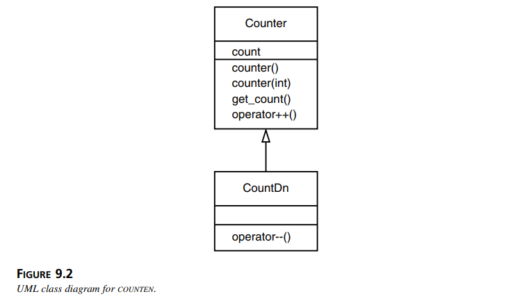
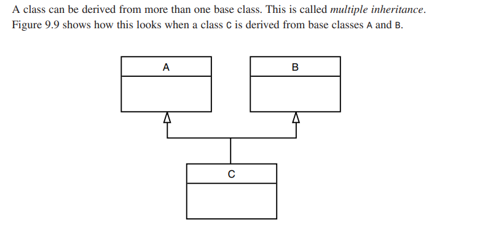

## Inheritance
- in uml the arrow is up, from the derived class to the base class called **"derived from"** arrow
    
<br>
- **Constructor inhertance:**
    - derived classes do not inherit constructors from their base classes directly. Constructors, destructors, and assignment operators are not inherited, because they are generally specific to the initialization, cleanup, and copying of the unique attributes of their respective classes.
    <br>
    - you can manually invoke base class constructors within a derived class constructor with initializer list 
        ```cpp
        class Base {
        public:
            Base(int x) {
            }
        };

        class Derived : public Base {
        public:
            Derived(int x, double y) : Base(x) {
            } // explicitly call Base(int) constructor 
            Derived(int x, int y) {
            } // error because compiler implicitly call default Base() constructor but it don't find it
        };
        ```
    - you can use Base constructor using ```using Base::Base;```
        But if derived constructor has same params it will override Base class and the compiler will implicitly call base class default constructor
- **Overriding Member Functions:**
    ```cpp
    class Stack
    {
    protected: //NOTE: can’t be private
    public:
        Stack(){ } 
        void push(int var);
    };
    class Stack2 : public Stack
    {
    public:
        void push(int var) { 
            // some modifications
            Stack::push(var); 
        }
    };
    ```
- **Public , Private and Protected Inheritance:**
    - it treats like we copy the code of Base class and copy it in derived class with the access modifier (data and member functions) if 
        - public : can't use private data and protcted data still protected and public still public
        - protected : can't use private data and protected still protected data but public will be protected 
        - private : all the data will be private but the can't access the private data in Base class

        ```cpp
        class A //base class
        {
        private:
            int privdataA;
        protected: 
            int protdataA;
        public:
            int pubdataA;
        };

        class B : public A 
        {
        public:
            void funct(){
                int a;
                a = privdataA; //error: not accessible
                a = protdataA; //OK
                a = pubdataA; //OK
            }
        };
        class C : private A
        {
        public:
            void funct(){
                int a;
                a = privdataA; //error: not accessible
                a = protdataA; //OK
                a = pubdataA; //OK but now is a private data in this class so if i derived from it i can't use this data
            }
        };
        class C : protected A
        {
        public:
            void funct(){
                int a;
                a = privdataA; //error: not accessible
                a = protdataA; //OK
                a = pubdataA; //OK but now is a protected data in this class so if i derived from it i can use it but i can't use it outside this class
            }
        };
        ```

### Multiple Inheritance:

- **Ambiguity in Multiple Inheritance:**
    - Here’s a common one. Two base classes have functions with the same name, while a class derived from both base classes has no function with this name so if we create an object of derived class then call the function the compiler generate **"ambiguous error"**
    - the solution is to determine the base class that the compiler use the function from :
        ```cpp
            class A
            {
            public:
                void show() {}
            };

            class B
            {
            public:
                void show() {}
            };

            class C : public A, public B
            {
            };

            int main()
            {
            C obj; 
                objC.show(); //ambiguous--will not compile
                obj.A::show(); //OK
                obj.B::show(); //OK
                return 0;
            }
        ```
    - Another kind of ambiguity arises if you derive a class from two classes that are each derived from the same class. **diamond-shaped inheritance** .
        ```cpp
        class A
        {
        public:
            void func(); 
        };

        class B : public A
        { };
        class C : public A
        { };
        class D : public B, public C
        { };

        int main()
        {
            D obj;
            obj.func(); //ambiguous: won’t compile
            obj.B::func(); //ok
            obj.C::func(); //ok
            return 0;
        }
        ```


