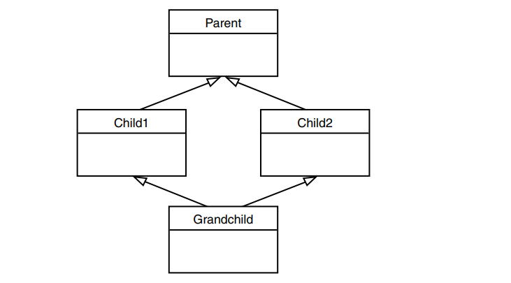

## Virtual Functions:
- Virtual means existing in appearance but not in reality and This is used in polymorphism, which means different forms
- For the polymorphic approach to work, several conditions must be met :
    - Share the same base class 
    - function must be declared to be virtual in the base class
- **Late Binding:**
    - how the compile know Which version of function the compiler will call ? 
      - In fact the compiler doesn’t know what to do, so it arranges for the decision to be deferred until the program is running. At runtime
      - This is called late binding or dynamic binding which requires some overhead but provides increased power and flexibility.
    - Choosing functions in the normal way, during compilation, is called early binding or static binding.
- **Abstract Classes and Pure Virtual Functions:**
    - what to do if we don’t want anyone to instantiate objects of the base class?
        - the answer is By placing at least one pure virtual
function in the base class. A pure virtual function is one with the expression =0 added to the declaration
            ```cpp 
            class Base
            {
            public:
                virtual void show() = 0; //pure virtual function
            };
            ```
            Notice that, although this is only a declaration, you
    never need to write a definition of the base class show(), although you can if you need to .
            ```cpp 
            class Base
            {
            public:
                virtual void show() = 0;
            };
            void Base::show(){
                cout << "Base class\n";
            }
            class Derived : public Base
            {
            public:
                void show() {
                    Base::show();
                    cout << "Derived class" ;
                }
            };
            ```
            **Note:** you can't make the definition here like this :
            ```cpp
            class Base
            {
            public:
                virtual void show() = 0{ // error: pure-specifier on function-definition
                    cout << "Base class\n";
                }
                // a pure specifier ('= 0') followed by a definition is nonstandard
            };
            ```
- **Virtual Destructors:**
    - Base class destructors should always be virtual if you don't do this 
    the destructor of the base class not derived class will be called
- **Virtual Base Classes and multiple inheritance:**
    
    <br>

    ```cpp
    class Parent
    {
    protected:
        int basedata;
    };

    class Child1 : public Parent
    { };

    class Child2 : public Parent
    { };

    class Grandchild : public Child1, public Child2
    {
    public:
        int getdata(){ 
            return basedata; // ERROR: ambiguous
            // can be solved by BaseClass::basedata ->
                                //Child1::basedata
            //Parent::basedata -> error Parent is ambiguous
                                
        } 
    };
    ```
    To eliminate the ambiguity, we make Child1 and Child2 into virtual base classes :
    ```cpp
    class Parent
    {
    protected:
        int basedata;
    };

    class Child1 : virtual public Parent // shares copy of Parent
    { };

    class Child2 : virtual public Parent // shares copy of Parent
    { };
    class Grandchild : public Child1, public Child2
    {
    public:
    int getdata(){
        return basedata;  // OK: only one copy of Parent
        }
    };
    ```
    - The use of the keyword virtual in these two classes causes them to share a single common subobject of their base class Parent. Since there is only one copy of basedata, there is no ambiguity when it is referred to in Grandchild.
    <br>
    - **Important Note:** The need for virtual base classes may indicate a conceptual problem with your use of multiple inheritance, so they should be used with caution

## Friend Functions:
- Imagine that you want a function to operate on objects of two different classes. Perhaps the function will take objects of the two classes as arguments, and operate on their private data. In this situation there’s nothing like a friend function.
- if we have overloaded operator+ :
    - we can write ```d3 = d1 + 10.0f;``` but what about : ```d3 = 10.0 + d1;``` it causes error ```no operator "+" matches these operands``` how we can solve it ?!
        - yes by friend functions :
            ```cpp
            class Distance
            {
            private:
                int feet;
                float inches;
            public:
                Distance(){ feet = 0; inches = 0.0; }
                Distance( float fltfeet ) {} //convert float to Distance
                Distance(int ft, float in) { feet = ft; inches = in; }

                void showdist() { cout << feet << "\'-" << inches << '\"'; }

                friend Distance operator + (Distance, Distance); //friend
            };

            Distance operator + (Distance d1, Distance d2)
            {
            return Distance(0,0); // return sum
            }
            ```
            ```cpp
            int main()
            {
            Distance d1 = 2.5;
            Distance d2 = 1.25; // conversion constructor call
            Distance d3;
            d3 = d1 + 10.0; //distance + float: OK
            d3 = 10.0 + d1; //float + Distance: OK
            // when compiler met 10.0 he call the constructor of conversion from float to distance
            return 0;
            }
            ```

